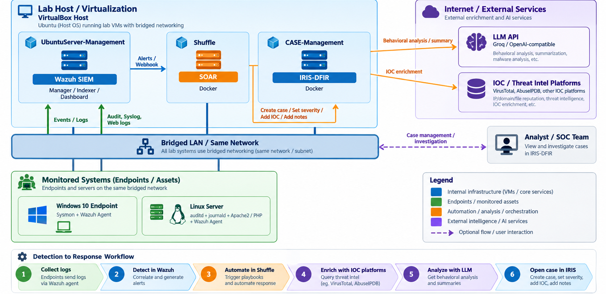
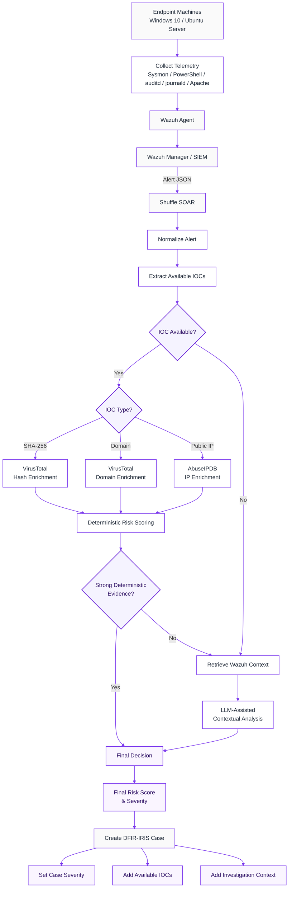
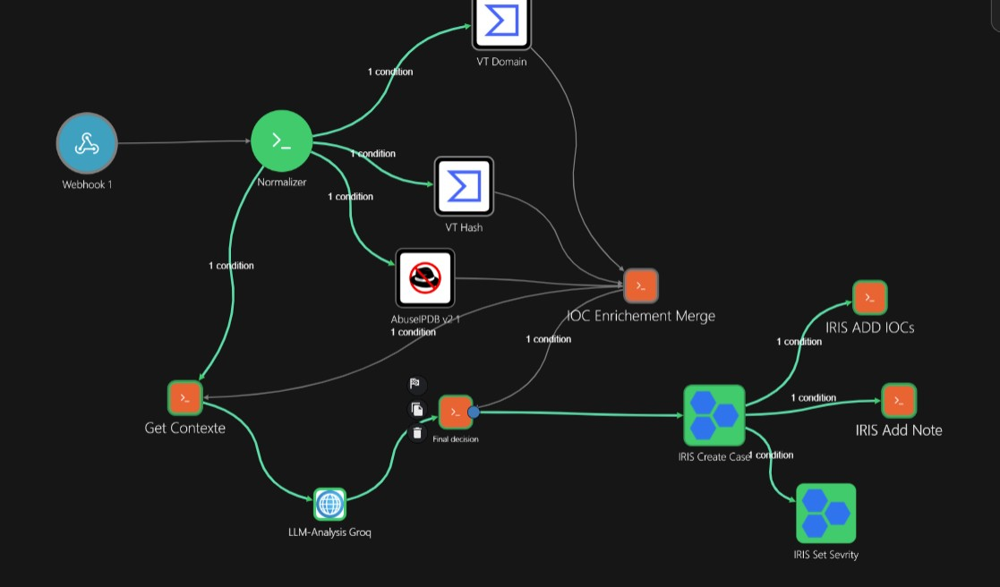
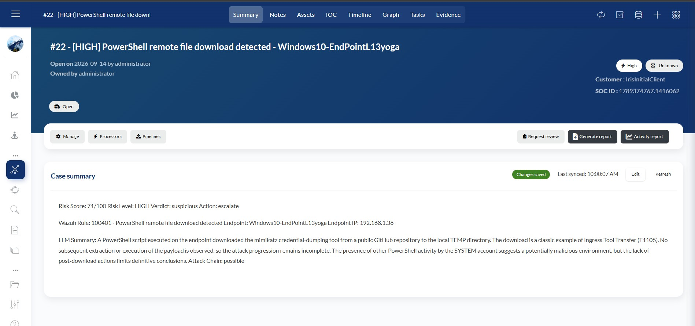
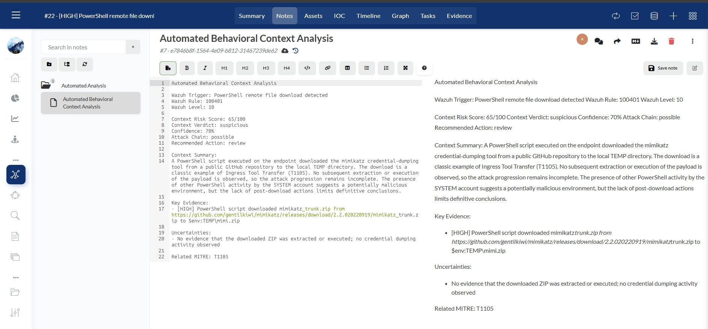
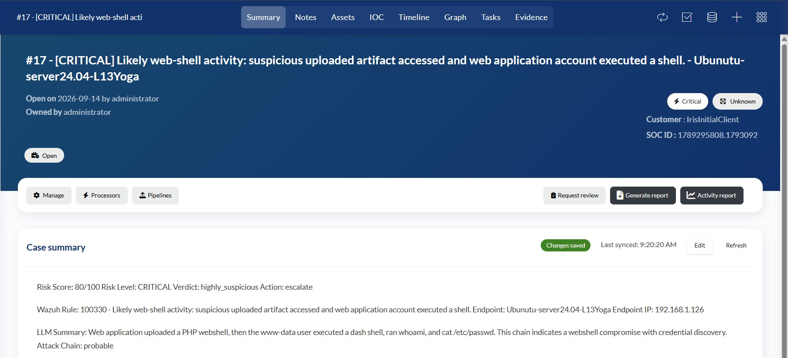
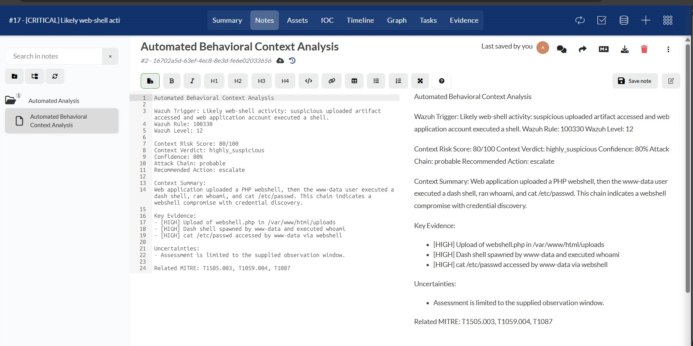

# Automated Soc investigation Lab

> A modular SOC lab that detects endpoint/server activity with Wazuh, performs conditional enrichment and behavioral triage in Shuffle, calculates a separate incident risk score, and opens structured investigations in DFIR-IRIS.

<p>
  
  
  
  
  
  
  
</p>

## Architecture

<p align="center">
  
</p>

The lab runs Wazuh, Shuffle and DFIR-IRIS as separate SOC services on the same bridged lab network. A Windows endpoint provides Sysmon/PowerShell telemetry and a Linux Apache/PHP server provides web/audit telemetry. Shuffle can reach VirusTotal, AbuseIPDB and an OpenAI-compatible Groq endpoint for enrichment and behavioral analysis.

## What the pipeline does

```text
Endpoint / Server telemetry
        -> Wazuh detection
        -> Shuffle webhook
        -> Normalize + extract observables
        -> Conditional IOC enrichment
        -> Optional Wazuh context lookup + LLM behavioral triage
        -> Final contextual risk score
        -> DFIR-IRIS case, severity, IOC(s) and analyst note
```

The key design choice is **conditional automation**: no hash means no hash lookup; private IPs are not sent to AbuseIPDB; an alert with no external IOC can still be analyzed using surrounding telemetry. Wazuh `rule.level` remains unchanged and is stored separately from the SOAR risk score.

## Implemented detection paths

| Scenario | Wazuh rule | ATT&CK | Main evidence |
|---|---|---|---|
| PowerShell remote file download | `100401` | T1105 | PowerShell 4104, URL/domain, optional hash/context |
| Multi-signal web-shell activity | `100330` / `100331` | T1505.003, T1059.004 | Apache/PHP request + Linux audit/shell context |

The PowerShell samples include both a benign text-file download and a Mimikatz archive download. The automation does not claim execution when the evidence only proves download activity.

## Shuffle workflow




<p align="center">
  
</p>


The workflow has four practical stages: normalize/routing, deterministic enrichment, contextual analysis, and IRIS handoff. VirusTotal handles domain/hash reputation, AbuseIPDB handles eligible public IPs, Wazuh supplies nearby events, and the behavioral branch uses a constrained JSON prompt that explicitly distinguishes observation from inference.

### Risk logic

Deterministic evidence and behavioral context are scored independently. The final decision keeps the stronger signal and can apply a small support boost when both sources are materially suspicious. Current bands are `Low <35`, `Medium 35–59`, `High 60–79`, `Critical >=80`. this threshold is intentionally documented and can be tightened for a different lab policy. See [docs/risk-model.md](docs/risk-model.md).

## Repository layout

```text
automated-soc-lab/
├── architecture/        # deployment + workflow diagrams
├── wazuh/               # custom rule and detection notes
├── shuffle/             # sanitized workflow, Python steps, LLM request body
├── iris/                # case/severity payloads and IOC integration notes
├── scenarios/           # two end-to-end scenario write-ups
├── evidence/            # sanitized raw alerts + selected screenshots
└── docs/                # risk model, security notes, original build plan
```

## Quick start

1. Clone the repository and copy `.env.example` to a private local secret file; do not commit it.
2. Add the Wazuh custom rule and verify Windows PowerShell/Sysmon collection plus Linux web/audit telemetry.
3. Import `shuffle/workflow-shuffle.sanitized.json`, then re-bind VirusTotal, AbuseIPDB and IRIS authentication.
4. Set private Wazuh Indexer, Groq and IRIS variables in Shuffle.
5. Send a known Wazuh alert to the Shuffle webhook and verify normalization, conditional routing, final scoring and IRIS creation.

The supplied raw alerts under `evidence/raw-alerts/` can be used to inspect expected field shapes without exposing the original lab addresses/hostnames.

## Evidence

<table>
<tr>
<td width="50%"></td>
<td width="50%"></td>
</tr>
<tr>
<td width="50%"></td>
<td width="50%"></td>
</tr>
</table>

## Security and scope

This is a home lab / portfolio implementation, not a production SOC reference architecture. The scoring model is intentionally explainable rather than mathematically sophisticated. Automated containment is out of scope, and the LLM is used for contextual triage rather than as a replacement for deterministic detection or analyst judgment.

The public workflow export is sanitized; real API keys and credentials are not included. Lab-only TLS shortcuts remain visible in code so they are not mistaken for production-safe defaults. See [docs/security.md](docs/security.md).

## Related detection project

The Linux web-shell correlation rules are maintained in a companion repository:
https://github.com/Yasserkdr1/Wazuh-Multi-Signal-Web-Shell-Detection

## License

MIT — use, adapt and extend the lab for authorized security learning.
