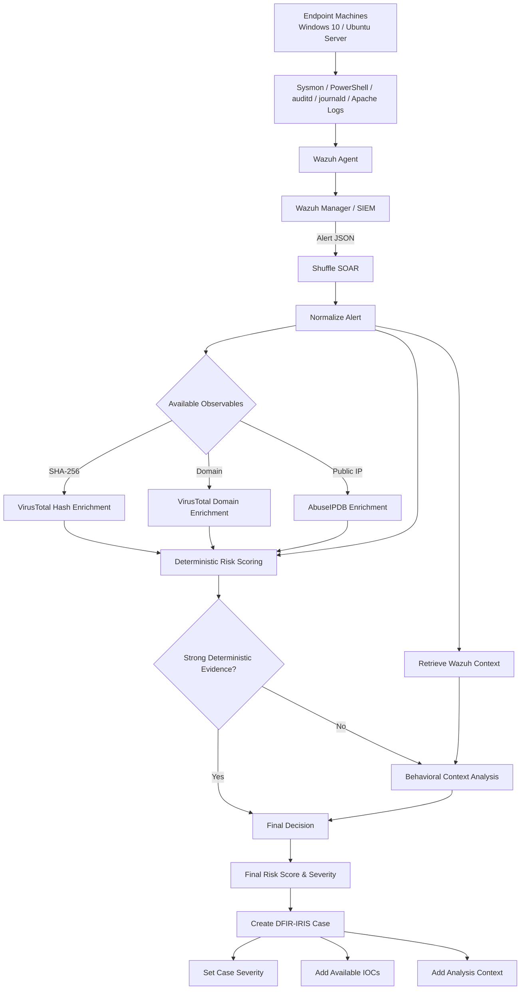
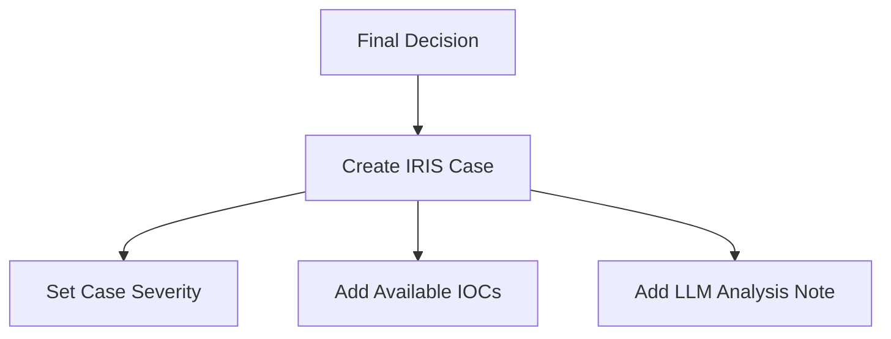

# Automated SOC Detection & Incident Response Lab

## 1. Project Goal

Build a small but complete **automated SOC lab** that demonstrates the full lifecycle of a security alert:

1. Simulate controlled ATT&CK activity in the lab.
2. Collect endpoint telemetry.
3. Send telemetry to **Wazuh** through the Wazuh agent.
4. Detect suspicious activity in Wazuh.
5. Forward relevant alerts to **Shuffle SOAR**.
6. Normalize alerts and extract available observables.
7. Run only relevant enrichment steps.
8. Calculate a separate **SOAR incident risk score** without modifying Wazuh severity.
9. Create **DFIR-IRIS cases** for investigation.
10. Document the detection-to-investigation chain in GitHub.

The project focuses on **two complete detection scenarios**.

---

## 2. Lab Stack

### Endpoint

**Physical Windows 10 PC — 8 GB RAM**

Components:

- Windows 10
- Sysmon
- Wazuh Agent
- PowerShell logging
- Atomic Red Team

Purpose:

- Generate endpoint telemetry
- Execute controlled adversary simulations
- Act as the monitored endpoint

### SOC Infrastructure

**Physical host — 32 GB RAM**

| Component | vCPU | RAM | Disk | OS |
|---|---:|---:|---:|---|
| Wazuh Manager | 4 | 8 GB | 80–100 GB | Ubuntu |
| Shuffle SOAR | 2 | 6 GB | 80–100 GB | Ubuntu |
| DFIR-IRIS | 2 | 4 GB | 50–60 GB | Ubuntu |

```text
Wazuh    8 GB
Shuffle  6 GB
IRIS     4 GB
-------------
Total   18 GB
```

This leaves approximately 14 GB for the host and hypervisor.

---

## 3. High-Level Architecture



Every alert that reaches `Final_decision` continues to IRIS case creation. The final risk score classifies severity:

```text
0–34    Low
35–59   Medium
60–79   High
80–100  Critical
```

---

## 4. Core Design Principle

Wazuh detection severity and SOAR incident risk remain separate.

### Wazuh Rule Level

`rule.level` is the severity assigned by the Wazuh detection rule and remains unchanged.

### SOAR Incident Risk

Shuffle calculates a separate contextual risk score using the available enrichment and behavioral evidence.

---

## 5. Network Design

All lab systems are reachable on the same network.

Example:

```text
Windows Endpoint    192.168.1.50
Wazuh Manager       192.168.1.60
Shuffle             192.168.1.61
DFIR-IRIS           192.168.1.62
```

Required communication:

```text
Endpoint
   ↓
Wazuh Manager
   ↓
Shuffle
   ↓
DFIR-IRIS
```

External enrichment:

```text
Shuffle
   |
   +--> VirusTotal API
   |     ├── SHA-256 hash reputation
   |     └── Domain reputation
   |
   +--> AbuseIPDB API
         └── Public IP reputation
```

---

## 6. Windows Telemetry

Required components:

- Sysmon
- Wazuh Agent
- PowerShell logging

Relevant telemetry includes process creation, command line, network connections, file creation, hashes, user and hostname.

### PowerShell Logging

The workflow relies on PowerShell logging for suspicious download activity and Script Block events.

### Sysmon

The Wazuh agent collects Sysmon events from:

```text
Microsoft-Windows-Sysmon/Operational
```

---

## 7. Detection Scenarios

The lab focuses on two alert types processed by the same Shuffle workflow.

### PowerShell Suspicious Download

Suspicious PowerShell download activity detected on the Windows 10 endpoint.

Full flow:

[`scenarios/01-powershell-suspicious-download.md`](scenarios/01-powershell-suspicious-download.md)

### WebShell Activity

Correlated WebShell activity detected on the Ubuntu server.

Full flow:

[`scenarios/02-webshell-activity.md`](scenarios/02-webshell-activity.md)

---

## 8. Wazuh Detection Requirements

For each scenario, document:

```text
Telemetry source
Triggered rule
Wazuh level
MITRE technique
Relevant raw fields
Detection reason
```

Custom rules are stored under:

```text
wazuh/
├── custom_rules.xml
└── README.md
```

---

## 9. Shuffle Workflow

See [`doc/shuffle.md`](doc/shuffle.md).

---

## 10. Risk Scoring Model

See [`doc/risk_model.md`](doc/risk_model.md).

---

## 11. DFIR-IRIS Integration

After `Final_decision`, Shuffle creates a DFIR-IRIS case directly.



The case contains the final risk information, Wazuh detection context, endpoint information and LLM analysis when available.

### Severity

`Final_decision` maps the final risk level to:

```text
LOW
MEDIUM
HIGH
CRITICAL
```

Wazuh `rule.level` remains unchanged.

### IOCs

When available, Shuffle can add:

```text
SHA-256
Domain
URL
Public IP
```

IOC values are deduplicated before being sent to IRIS. Private/non-global IPs are not added through the automated IOC branch.

### Behavioral Analysis Note

When LLM analysis was executed, Shuffle can add an **Automated Behavioral Context Analysis** note containing the context score, verdict, confidence, attack chain, summary, evidence, uncertainties and related MITRE techniques.

If no LLM analysis exists, no behavioral-analysis note is added.
