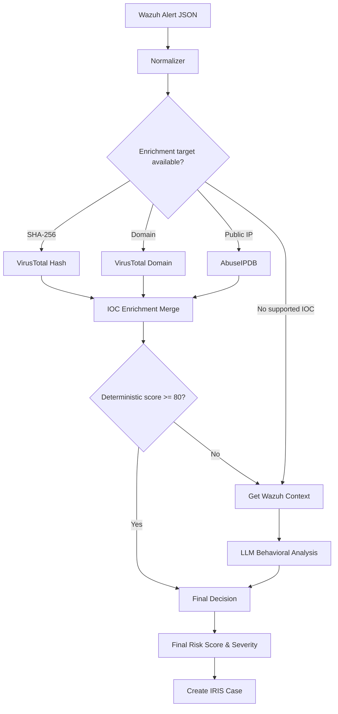

# Shuffle SOAR Workflow

## Scope

Shuffle receives supported Wazuh alerts and orchestrates normalization, IOC enrichment, deterministic scoring, optional behavioral context analysis, final risk calculation, and DFIR-IRIS case creation.

Currently supported Wazuh rules:

| Rule | Alert type |
|---|---|
| `100401` | `POWERSHELL_DOWNLOAD` |
| `100330` | `WEBSHELL_ACTIVITY` |
| `100331` | `WEBSHELL_ACTIVITY` |

## Workflow



## Alert Normalization

The normalizer converts supported Wazuh alerts into one internal structure.

```json
{
  "schema_version": "1.0",
  "normalization_status": "ok",
  "supported": true,
  "alert_type": "POWERSHELL_DOWNLOAD",
  "trigger": {
    "alert_id": "...",
    "timestamp": "...",
    "rule_id": "100401",
    "rule_level": 10,
    "rule_description": "...",
    "mitre_ids": ["T1105"],
    "mitre_techniques": ["Ingress Tool Transfer"]
  },
  "agent": {
    "id": "...",
    "name": "...",
    "ip": "..."
  },
  "evidence": {},
  "observables": {
    "sha256": [],
    "urls": [],
    "domains": [],
    "public_ips": [],
    "private_or_non_global_ips": []
  },
  "routing": {
    "virustotal_hash": false,
    "virustotal_domain": false,
    "abuseipdb_ip": false
  }
}
```

Evidence fields depend on the alert type. PowerShell alerts preserve script-block and download information; WebShell alerts preserve available HTTP, source-IP, shell, audit and file evidence.

## Observable Routing

Only three external enrichment routes are implemented:

```text
SHA-256    → VirusTotal
Domain     → VirusTotal
Public IP  → AbuseIPDB
```

Routing is enabled only when the corresponding observable exists.

URLs are extracted and preserved but do not have a dedicated enrichment route. Private or non-global IPs are preserved as evidence and are not sent to AbuseIPDB.

If none of the three supported enrichment targets is available, the normalizer sets `get_contexte = true`.


## Wazuh Context and LLM

Wazuh context is retrieved in two cases:

```text
No supported external IOC
OR
Deterministic score < 80
```

`get_contexte.py` queries nearby events for the same Wazuh agent using the time window generated by the normalizer. It selects the most relevant events and sends that compact context to the LLM behavioral-analysis step.

If the deterministic score is already `>= 80`, the workflow proceeds directly to `Final_decision`.

## Final Decision

`Final_decision` uses the available deterministic and behavioral scores.

- If only one score exists, it is used directly.
- If both exist, the higher score is dominant.
- When the lower score is at least `35`, it adds a `15%` support boost.
- The final score is capped at `100`.

Wazuh `rule.level` is preserved and is never replaced by the SOAR risk score.

## IRIS Output

The workflow creates an IRIS case after `Final_decision` and prepares:

- final risk score and severity
- case title and priority
- extracted IOCs
- LLM analysis note when available

The current Shuffle branch from `Final_decision` to case creation is unconditional. Risk-based case filtering is not currently enforced in the workflow.
