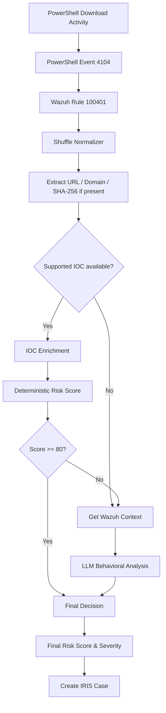

# PowerShell Suspicious Download

## Objective

Detect a remote file download performed through PowerShell and send the alert through the automated SOC workflow.

## Detection

- **Endpoint:** Windows 10
- **Wazuh rule:** `100401`
- **Rule level:** `10`
- **MITRE ATT&CK:** `T1105 — Ingress Tool Transfer`
- **Telemetry:** PowerShell Script Block Logging
- **Event ID:** `4104`

The rule detects PowerShell `DownloadFile(...)` activity. The detection confirms the download command; it does not assume that the downloaded file was executed.

## Workflow

## Normalization and Enrichment

The normalizer preserves the PowerShell script block, destination file and extracted observables.

Implemented enrichment routes:

| Observable | Provider |
|---|---|
| SHA-256 | VirusTotal |
| Domain | VirusTotal |
| Public IP | AbuseIPDB |

In the captured PowerShell alerts, the script block contains a URL, so the domain is extracted and routed to VirusTotal. A SHA-256 is enriched only when it is present in the original Wazuh alert.

## Risk Path

IOC enrichment is merged with the Wazuh source score to produce the deterministic risk score.

- `deterministic risk >= 80` → skip behavioral analysis and continue to `Final_decision`
- `deterministic risk < 80` → retrieve nearby Wazuh events and run the LLM behavioral analysis
- no enrichable IOC → retrieve Wazuh context directly

`Final_decision` produces the final risk score and severity before the workflow creates the IRIS case.

## Evidence

- `../../evidence/raw-alerts/ps_download_atomic_txt.json`
- `../../evidence/raw-alerts/ps_download_mimkatz.json`
- `../../evidence/screenshots/01-iris-powershell-mimikatz.jpg`
- `../../evidence/screenshots/02-iris-powershell-mimikatz-note.jpg`
- `../../evidence/screenshots/03-iris-powershell-benign-artifact.jpg`

## Key Point

A PowerShell download is not automatically treated as malicious. External IOC reputation and nearby endpoint activity provide the additional context used by the workflow.
