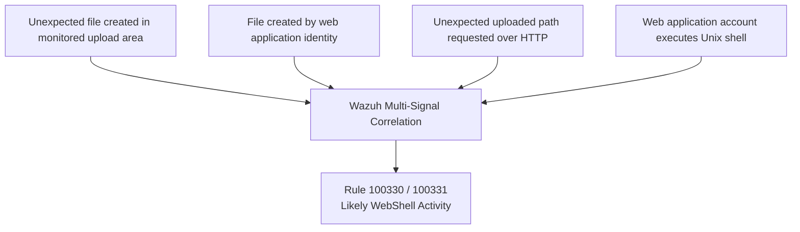
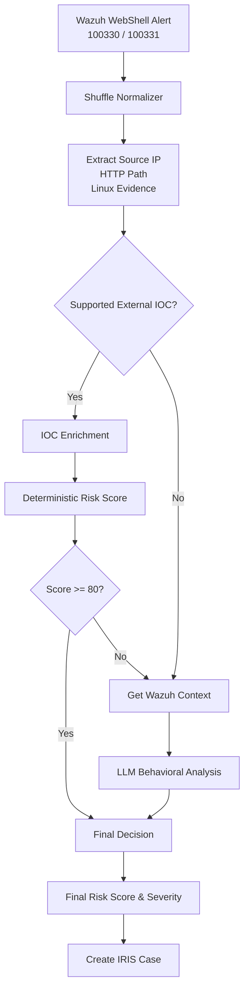

# WebShell Activity

## Objective

Detect likely WebShell activity on the Ubuntu web server through **multi-signal correlation**, then send the resulting Wazuh alert through Shuffle for contextual analysis, risk scoring, and IRIS case creation.

## Detection

- **Endpoint:** Ubuntu Server / Apache
- **Final Wazuh rules:** `100330` / `100331`
- **Severity:** `12`
- **MITRE ATT&CK:** `T1505.003 — Web Shell`, `T1059.004 — Unix Shell`
- **Telemetry:** Wazuh FIM/Who-data, Apache access logs, Linux Auditd

The detection does **not** depend on a specific filename such as `webshell.php`. It correlates several independent signals around unexpected web content and shell execution by the web application account.



The captured lab alert contains `/uploads/webshell.php`, but this is the artifact used during validation, **not the detection signature**.

For the complete detection-engineering process, custom rules, validation sequence, limitations, and evidence, see:

[Wazuh Multi-Signal Web Shell Detection](https://github.com/Yasserkdr1/Wazuh-Multi-Signal-Web-Shell-Detection)

## SOAR Workflow

The correlated Wazuh alert is sent to Shuffle and normalized as `WEBSHELL_ACTIVITY`.



## Current Lab Path

In the captured WebShell alert, the source IP is private and the HTTP value is a relative path. The alert therefore has no supported external IOC for reputation lookup.

```text
Wazuh WebShell alert
        ↓
Normalizer
        ↓
No external IOC enrichment
        ↓
Retrieve nearby Wazuh events
        ↓
LLM behavioral analysis
        ↓
Final decision
        ↓
IRIS case
```

Private/non-global IPs are preserved as investigation evidence but are not sent to AbuseIPDB.

## Evidence

- `../../evidence/raw-alerts/webshell_alert.json`
- `../../evidence/screenshots/04-iris-webshell-summary.jpg`
- `../../evidence/screenshots/05-iris-webshell-llm-note.jpg`

## Key Point

The WebShell detection is based on **correlated host and web telemetry**, not on a single filename, extension, URL, or signature. Shuffle receives the already-correlated Wazuh alert and adds contextual risk analysis before creating the IRIS case.
